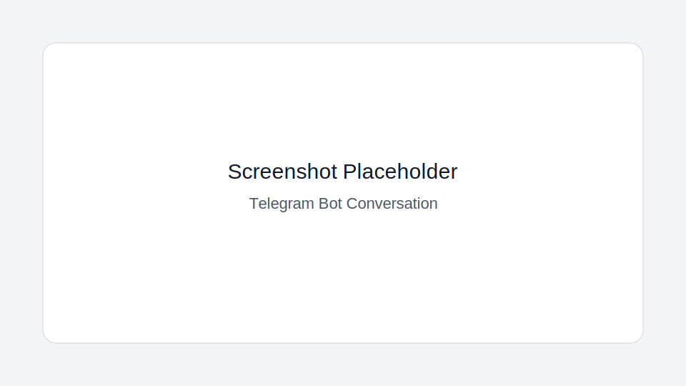
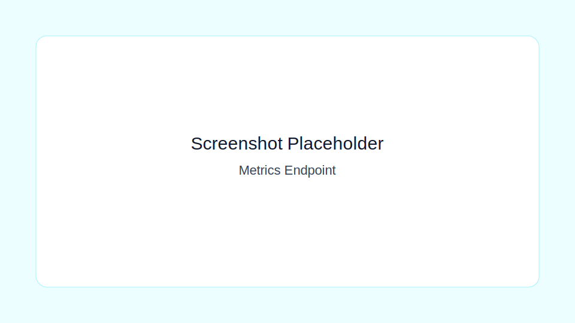
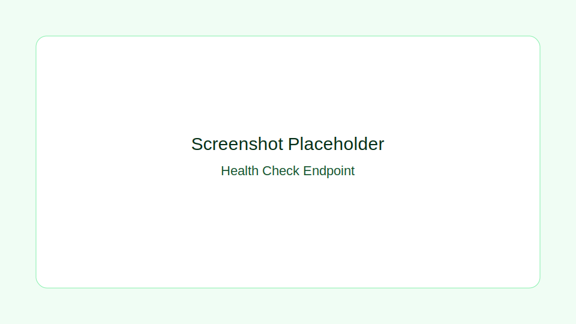

# VerTel Bot

[](https://github.com/<OWNER>/<REPO>/actions/workflows/ci.yml)
[](https://github.com/<OWNER>/<REPO>/releases)
[](LICENSE)
[](https://isocpp.org/std/the-standard)

A C++20 Telegram Bot API engine aiming to be a cleaner, more extensible, more production-hardened evolution path beyond typical wrapper-style libraries. VerTel Bot is now positioned as a **library-first core** (with runnable examples), not a separate app-product direction.

## Project intent (re-aligned)

This project is intended to be your **"tgbot-cpp but better"** direction:
- cleaner architecture boundaries,
- easier extension points,
- stronger production defaults,
- better operability/testing/tooling.

The runnable binary in this repo exists as a **reference harness** for validating the engine, not as a different end-product.

## What VerTel improves

- Clear layered architecture (`core`, `adapters`, `runtime`, `platform`) for long-term maintainability
- Built-in operational primitives (retry, graceful shutdown, health/metrics)
- Middleware patterns (auth allowlist, rate limiting, command routing)
- CI/release/community scaffolding ready for serious open-source/project growth
- C++20 baseline with testable seams and dependency-light defaults

## Architecture (ASCII)

```text
+-------------------------+
| examples/basic_bot/main |
| Composition + lifecycle |
+-----------+-------------+
            |
            v
+-----------+-------------+
|           core          |
| BotService, handlers,   |
| command routing         |
+-----------+-------------+
            |
   +--------+--------+
   v                 v
+--+-----------------+--+      +----------------------+
|      adapters         |      |       runtime        |
| Telegram client       |<---->| logging, retry,      |
| (poll/send via HTTP)  |      | metrics, shutdown,   |
+-----------+-----------+      | health server         |
            |                  +----------+-----------+
            v                             |
+-----------+-----------+                 v
|       platform        |        +--------+---------+
| env/config parsing    |        | external systems |
+-----------------------+        | Telegram + infra |
                                 +------------------+
```

See `docs/ARCHITECTURE.md` for details.

## Scope boundaries

- **Current:** Telegram-first engine + reference executable + production primitives.
- **Not the goal:** becoming a random generic bot app unrelated to Telegram core evolution.
- **Primary goal:** iterate toward a robust Telegram bot core/library that can supersede simplistic wrappers.

## Quickstart

### 1. Prerequisites

```bash
sudo apt-get update
sudo apt-get install -y build-essential cmake libcurl4-openssl-dev
```

### 2. Build and test

```bash
cmake -S . -B build -DCMAKE_BUILD_TYPE=Release
cmake --build build -j
ctest --test-dir build --output-on-failure
```

### 3. Run (Telegram mode)

```bash
export TELEGRAM_BOT_TOKEN="<bot-token>"
./build/vertel_basic_bot
```

### 4. Run (sample mode, no Telegram calls)

```bash
VERTEL_INJECT_SAMPLE_START=1 ./build/vertel_basic_bot
```

### 5. Docker

```bash
docker compose up --build
```

## Configuration

Required:

- `TELEGRAM_BOT_TOKEN`: Bot token from BotFather

Optional:

- `VERTEL_INJECT_SAMPLE_START` (default `0`)
- `VERTEL_TELEGRAM_LONG_POLL_TIMEOUT_SECONDS` (default `25`)
- `VERTEL_TELEGRAM_REQUEST_TIMEOUT_SECONDS` (default `35`)
- `VERTEL_POLL_MAX_ATTEMPTS` (default `5`)
- `VERTEL_POLL_INITIAL_BACKOFF_MS` (default `250`)
- `VERTEL_LOOP_SLEEP_MS` (default `50`)
- `VERTEL_RATE_LIMIT_CAPACITY` (default `5`)
- `VERTEL_RATE_LIMIT_REFILL_TOKENS` (default `5`)
- `VERTEL_RATE_LIMIT_REFILL_SECONDS` (default `10`)
- `ADMIN_CHAT_IDS` (default empty; comma-separated)
- `VERTEL_HTTP_PORT` (default `8080`, set `<=0` to disable)

## Observability

- `GET /healthz` -> `200 OK` with body `ok`
- `GET /metrics` -> plaintext counters
  - `vertel_updates_processed_total`
  - `vertel_messages_sent_total`
  - `vertel_handler_failures_total`
  - `vertel_rate_limit_rejections_total`

## Screenshots

Placeholders (replace with real captures):

- 
- 
- 

## Roadmap

- Short term: stronger tests around adapters and config validation
- Medium term: webhook transport option and persistent rate limits
- Long term: plugin/event extension model and multi-platform chat adapters

See `docs/ROADMAP.md` for milestones.

## Contributing and project policies

- Contribution guide: `CONTRIBUTING.md`
- Code of conduct: `CODE_OF_CONDUCT.md`
- Security policy: `SECURITY.md`
- Changelog: `CHANGELOG.md`
- Operations runbook: `OPERATIONS.md`
- Consumer package docs: `docs/CONSUMING.md`

## Deployment

`systemd` unit is available at `deploy/vertel-bot.service`.

## License

MIT License. See `LICENSE`.
